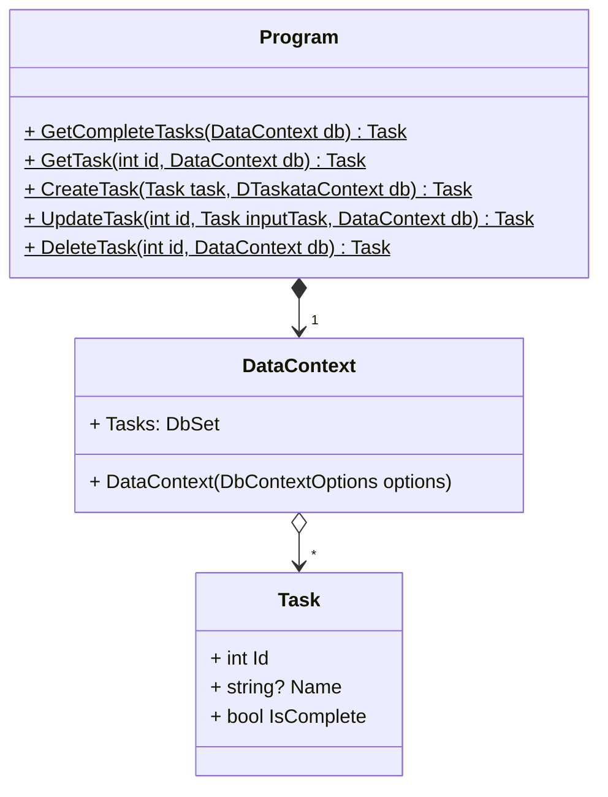

```mermaid
classDiagram
    class Task {
        + int Id
        + string? Name
        + bool IsComplete
    }

    class DataContext {
        + DataContext(DbContextOptions<DataContext> options)
        + Tasks: DbSet<Task>
    }

    class Program {
        + GetCompleteTasks(DataContext db) Task<IResult>$
        + GetTask(int id, DataContext db) Task<IResult>$
        + CreateTask(Task task, DTask<IResult>ataContext db) Task<IResult>$
        + UpdateTask(int id, Task inputTask, DataContext db) Task<IResult>$
        + DeleteTask(int id, DataContext db) Task<IResult>$
    }

    Program *--> "1" DataContext
    DataContext o--> "*" Task
```